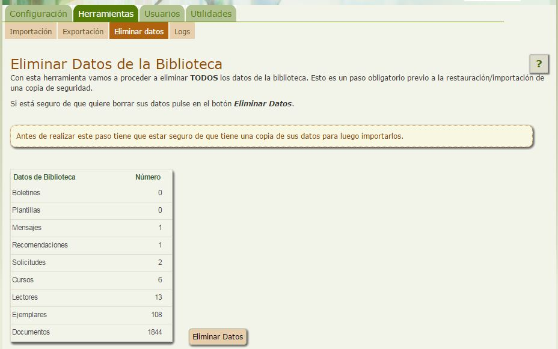

# Cómo eliminar todos los datos

En alguna ocasión, puede ser que necesitemos eliminar por completo todos los datos de nuestra biblioteca. Será en momentos muy críticos, como la restauración de una copia de seguridad, o el inicio de empezar a trabajar con Abiesweb después de un período de pruebas por la plataforma.

Llegado ese momento, el proceso es muy sencillo. Debemos acceder a la pestaña **Herramientas** opción **Eliminar Datos:**

Una vez allí, pulsando el botón Eliminar Datos comenzará el proceso de borrado, que le puede llevar unos minutos en función del volumen de fondos y ejemplares de nuestra biblioteca.

