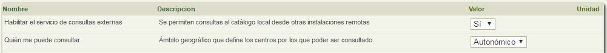

# Colaborar con otras bibliotecas Abiesweb

Una de las mejoras que trae Abiesweb es la posibilidad de colaborar entre diferentes bibliotecas que están trabajando con Abiesweb. 

Esta posibilidad de que lectores de otras bibliotecas Abies accedan a nuestro catálogo y viceversa, es algo que el administrador Abiesweb de nuestra biblioteca puede decidir abrir o no. 

Para ello podrá utilizar los parámetros de configuración que aparecen en la pestaña **Configuración** y opción **Parámetros de Administración**:

- Si queremos que los lectores de otras bibliotecas abiesweb consulten nuestro catálogo, deberemos modificar los dos valores siguientes:

- Si queremos que los lectores de nuestra biblioteca puedan consultar el catálogo de otras bibliotecas, modificaremos entonces estos otros dos parámetros:

Dentro del ámbito geográfico podré elegir si quiero consultar o que me consulten a nivel:

- Local
- Provincial
- Autonómico
- Estatal
- Global

La colaboración entre las bibliotecas con Abiesweb no se limita únicamente a la consulta de los catálogos, sino que además los bibliotecarios pueden importar fondos de una biblioteca a otra, aprovechando el trabajo de catalogación realizado ya por otros compañeros bibliotecarios.

