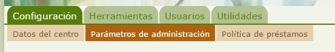
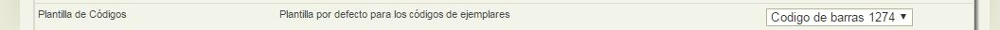
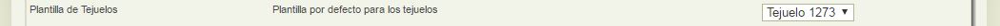
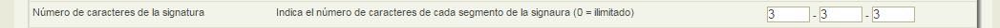
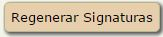

# Configurar etiquetado de Ejemplares

De nuevo deberemos situarnos en la pestaña **Configuración** opción **Parámetros de administración**:

Aquí tenemos la posibilidad de configurar los siguientes datos respecto a etiquetado de Ejemplares:

- Plantilla para los códigos de barras.

- Plantilla para los tejuelos.

- Número de caracteres que conforman la signatura del tejuelo.

En cualquiera de los casos de plantillas, cuando pulsemos sobre la operación de imprimir carnet, nos aparecerá por defecto la plantilla que se haya definido desde el perfil administrador Abiesweb, pero podríamos seleccionar en ese momento otra si lo creemos conveniente.

Respecto a los cambios en las signaturas, si modificamos el número de caracteres de cada campo, es necesario actualizar los tejuelos de los ejemplares ya existentes en nuestro catálogo. Para ésto iremos al listado de Ejemplares y pulsaremos en el botón  que aparece bajo el listado.

