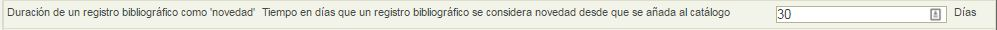
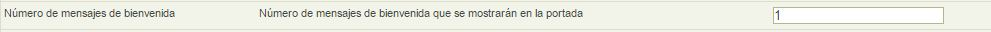
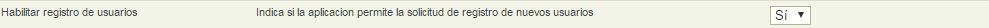

# Configurar la pantalla de inicio de nuestra biblioteca

Desde el perfil de Administrador Abiesweb es posible configurar algunas características de la página de inicio de nuestra biblioteca:

Si quieres revisar de qué secciones se compone la página de inicio, puedes pulsar en el siguiente [enlace](descripcin_de_la_pantalla_de_inicio.html).

Para modificar algunas de las características de la página de inicio, deberemos situarnos en la pestaña **Configuración** y la opción **Parámetros de administración**.

Desde aquí podremos configurar los siguiente:

- Modificar el número de fondos que aparecen en el listado como los más prestados.

- Definir por cuanto tiempo consideramos un fondo como Novedad, para que aparezca en su sección correspondiente.

- Modificar el número de Mensajes de bienvenida que queremos que se muestren en la sección de Información de interés

- Decidir si queremos que aparezca o no la opción de que los lectores puedan registrarse en la plataforma.

