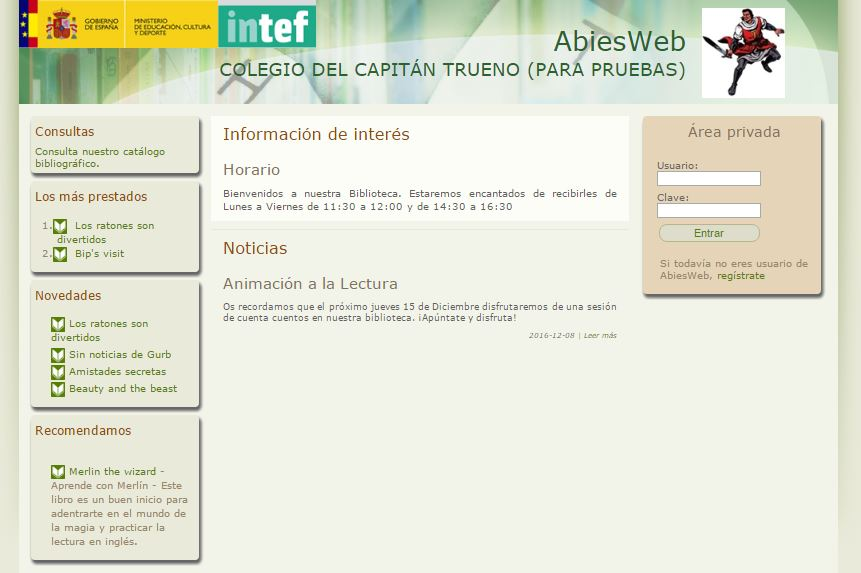
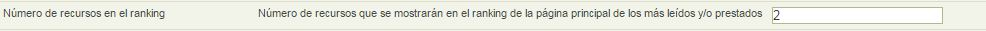

# Descripción de la pantalla de inicio

Cuando accedemos a la dirección de nuestra biblioteca en **Abiesweb**, nos encontramos con la siguiente página:

En esta página aparecen las siguientes secciones:

<li style="text-align: left;">En la zona de la izquierda:
<ul>
- Enlace a nuestro catálogo: puede ser accedido por cualquier persona sin necesidad que tenga un nombre de usuario y contraseña.
- Un listado de los más prestados.
- Las últimas novedades incorporadas a nuestra biblioteca.
- Recomendaciones. Creadas por el perfil Bibliotecario desde la pestaña Otros &gt;&gt; Recomendaciones.

- Información de interés. Creado por el perfil Bibliotecario desde la pestaña Otros &gt;&gt; Mensajes de bienvenida.
- Noticias. Creadas por el perfil Bibliotecario desde la pestaña Boletines.

- Usuario y contraseña.
- Enlace para el registro en Abiesweb. 

