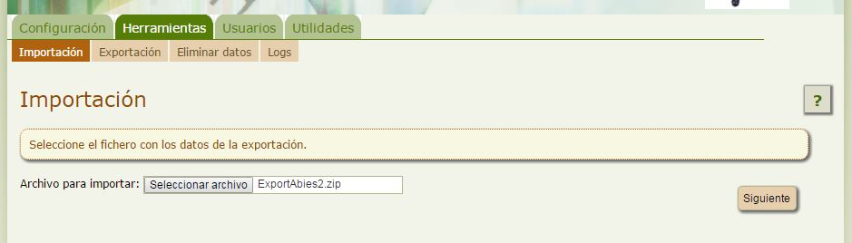

# Hacer uso de una copia de seguridad

Restaurar en nuestra biblioteca una copia de seguridad es una tarea muy sencilla:

1. Eliminamos los datos actuales de la biblioteca, para restaurar sobre una biblioteca limpia. Para consultar cómo eliminarlos visita este [enlace](cmo_eliminar_todos_los_datos.html).
<li>Importamos el fichero que guardamos como copia de seguridad. Para ello:
<ul>
1. Hacemos click en la pestaña **Herramientas** opción **Importar**.
1. Pulsamos el botón **Seleccionar archivo** y localizamos nuestro archivo con la copia de seguridad.
1. Pulsamos el botón Siguiente y vamos siguiendo el proceso.
</ul>
</li>

