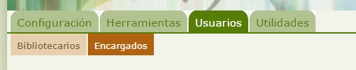
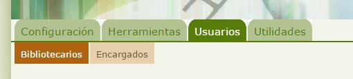

# Nombrar Bibliotecarios y Encargados

Abiesweb permite nombrar a algunos de sus Lectores como Encargados o incluso Bibliotecarios. 

Ésta funcionalidad es muy útil para dotar de responsabilidades en nuestra biblioteca a otros lectores que quieran colaborar con su gestión.

- **Encargado: tendrá permisos para realizar préstamos, devoluciones y gestión de reservas. También podrá gestionar los lectores, pero no podrá modificar el catálogo, aunque sí colaborar en la gestión de sus valores Auxiliares.**

Para la asignación de usuarios lectores como encargados nos moveremos a la siguiente opción: 

Para dar permiso de encargado a un Lector, únicamente deberemos escribir su nombre o código en la caja de texto que aparece bajo "Asignar nuevo encargado" y a continuación pulsar el botón "Asignar". 

Es imprescindible que ese lector ya exista en nuestra biblioteca.

- **Bibliotecario**:** tendrá todos los permisos para realizar todas las operaciones del perfil Bibliotecario.**

Para la asignación de usuarios lectores como bibliotecarios nos moveremos a la siguiente opción: 

Para dar permiso de bibliotecario a un usuario lector, únicamente deberemos escribir su nombre o código en la caja de texto que aparece bajo "Asignar nuevo bibliotecario" y a continuación pulsar el botón "Asignar". 

