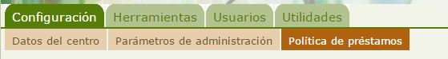

# Política de Préstamos

Desde el perfil de Administrador Abiesweb podremos definir la política de préstamos de nuestra biblioteca, es decir, por cuántos días se va a prestar, si se permite o no prórroga, de cuanto tiempo...

Para ello nos situaremos en la pestaña **Configuración** opción **Política de préstamos**.

En la política de préstamo definiremos los siguientes valores:

<li>**Tipos de ejemplares**: normal, de sala, restringido...
<ul>
- Esto nos sirve para hacer diferenciaciones si entre nuestros ejemplares existen algunos que no queremos darles el mismo permiso de préstamo que a otros.
- Para definir un tipo de ejemplar, únicamente es necesario escribir el nombre de ese tipo en 
<li>Para cada tipo de ejemplar especificaremos:
<ul>
- **Días en préstamo**: Por cuantos días podrá tener el lector ese ejemplar.
- **Número de préstamos**: Cuantos ejemplares de ese tipo puede tener al mismo tiempo un lector

En la imagen anterior vemos un ejemplo de política de préstamo, en la que se han definido tres tipos de ejemplares:

- Normal, que se puede prestar por 15 días y un máximo de tres ejemplares normales.
- Restringido, que se puede prestar por 7 días y únicamente un ejemplar de este tipo.
- No prestable, para ejemplares de consulta en sala, por ejemplo.

Esta política de préstamo es la definida para el tipo de lector Alumno, pero podríamos definir **políticas diferentes para distintos tipos de Lectores**.

Para definir un nuevo tipo de lector, utilizaríamos el icono   y completaríamos los campos descritos anteriormente.

