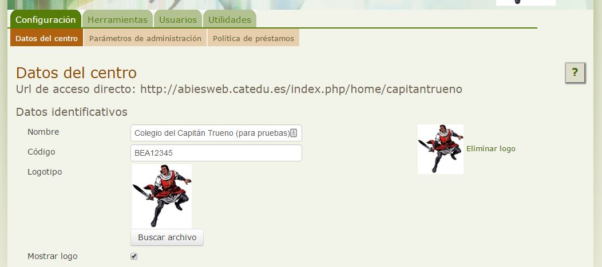

# Usar el Logo del centro

Una de las opciones para personalizar nuestra biblioteca es poder utilizar nuestro logo. 

El logo del centro aparecerá en:

- Cabecera de Abiesweb.
- Impresión de los carnets de los lectores de nuestra biblioteca.

Para subir el archivo de imagen con el logo de nuestro centro lo haremos desde:

Una vez hayamos subido el archivo y marcado que queremos mostrar el logo, aparecerá en la cabecera de la web:

Lo mismo que en los carnets:

